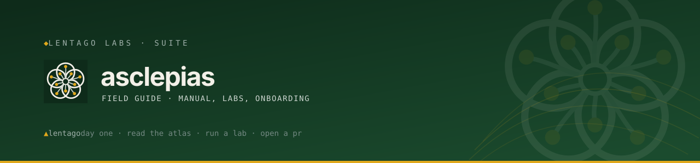

<!-- Lentago Labs brand header — generated by lentago/.github → brand/generate.py.
     Regenerate there; do not hand-edit the banner or badge URLs. -->

  

  

# asclepias

**Asclepias** (milkweed — the botanical codename line alongside `lentago`,
`solidago`, `kalmia`, `drosera`, `claytonia`, `betula`, `brasenia`, and
`myosotis`) is the Lentago Labs **field guide**: the shared operations manual,
a day-one path, and numbered hands-on labs. Milkweed is the host plant — the
one every monarch finds its way to. This repo plays that role here: it's where
you land, look around, and try something against a real fleet.

**Authorship:** The manual, labs, and documentation in this repo are co-written
with [Claude](https://claude.ai) (Anthropic). I direct the work and review the
output; Claude writes the prose. I'm an infrastructure operator, not a software
engineer — please don't read this repo as a portfolio of coding ability.

## 📚 Ask this codebase (DeepWiki)

> [DeepWiki](https://deepwiki.com/lentago/asclepias) maintains an AI-generated
> wiki over this repository — pages, structure, and a Q&A box grounded in the
> actual content. Every public Lentago Labs repo is indexed
> ([deepwiki.com/lentago](https://deepwiki.com/lentago)); because the manual is
> plain Markdown with stable headings, the whole manual is ask-able. It is
> AI-generated: trust it to orient you, verify against the source before you
> act on it.

**Good first questions:**

- What order do the labs run in, and what's each one about?
- Where in the fleet is apply-on-merge actually enforced, according to the
  pattern catalog?
- What does the glossary say "change management" maps to in this lab?

## 🧭 What this repo demonstrates

This repo runs on the same patterns it catalogs — starting with how it was born.

| Pattern | How it shows up here |
|---|---|
| **The paved road** — new repos start compliant, not drift into it | This repo was created from [`lentago/repo-template`](https://github.com/lentago/repo-template) (README/CLAUDE skeletons, MIT, CI wrappers), then adopted into [fleet settings-as-code](https://github.com/lentago/.github) — squash-only merges, spine topics, a `main` ruleset, and a required `docs-check` from its first PR. |
| **Docs-as-code** — the manual is versioned, reviewed, link-checked | Every page is plain Markdown under [`manual/`](manual/); [`docs-check`](.github/workflows/docs-check.yml) (a thin wrapper over the shared reusable workflow) gates every PR, so a broken link can't merge. |
| **Lab runs as issues** — every lab run is a tracked artifact | Labs live in [`labs/`](labs/) with an [issue template](.github/ISSUE_TEMPLATE/lab-run.yml); opening a lab issue gives each run a durable record, review thread, and finish line. |
| **Claims carry evidence** — no pattern without a link to where it's live | The [pattern catalog](manual/pattern-catalog.md) cites the owning repo and file/PR for every row — the same evidence discipline every fleet README follows. |
| **LLM-consumable by design** — one manual, many readers | Pages are self-contained with stable headings, so DeepWiki, an agent with a checkout, or a colleague with a browser all get the same answers. |

## 🛠️ Make a change yourself

This is a lab — the systems are real, the stakes are not. Pick whatever
sounds fun:

**Run a lab.**
Open a [lab-run issue](https://github.com/lentago/asclepias/issues/new/choose), pick your rung from the
[ladder](labs/README.md), and work it. Lab 01 ends with your name merged into
the [roster](onboarding/roster.md) — your first PR through the fleet's change
gate.

**Add or sharpen a lab.**
Edit or add a numbered exercise under [`labs/`](labs/) and open a PR. The
required `docs-check` must pass; a maintainer reviews and merges. Labs follow a
fixed shape (goal, access needed, steps, proof) — see
[`labs/README.md`](labs/README.md).

**Extend the manual.**
Spot a pattern in the fleet the [catalog](manual/pattern-catalog.md) doesn't
cover yet, or an enterprise term the [glossary](manual/glossary.md) doesn't map?
Add a row with an evidence link and open a PR. The manual grows by harvest,
not by invention.

## What's here

| Path | Purpose |
|---|---|
| [`onboarding/`](onboarding/) | The day-one path and the member roster |
| [`manual/`](manual/) | The operations manual: estate atlas, pattern catalog, glossary, runbook index |
| [`labs/`](labs/) | Numbered hands-on exercises, L0 → L4 |
| [`.github/ISSUE_TEMPLATE/`](.github/ISSUE_TEMPLATE/) | The lab-run issue form |
| [`docs/adr/`](docs/adr/) | Architecture decisions — why this repo is shaped the way it is |

---

> 🌱 **Lentago Labs** is a team learning lab — real systems, non-critical
> stakes, modern operations patterns demonstrated in the open. Start at the
> [org profile](https://github.com/lentago), and read this repo on
> [DeepWiki](https://deepwiki.com/lentago/asclepias).
